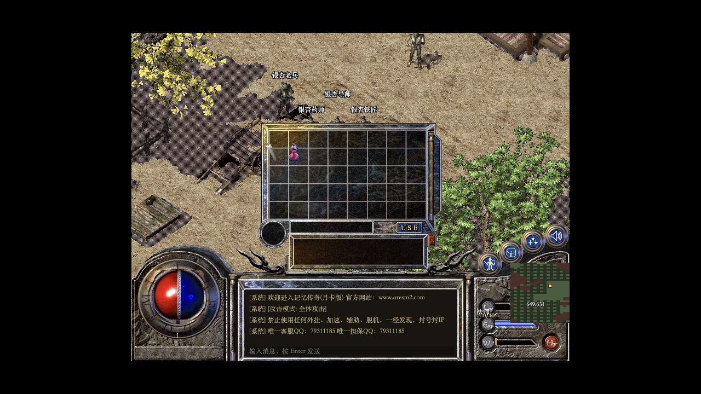
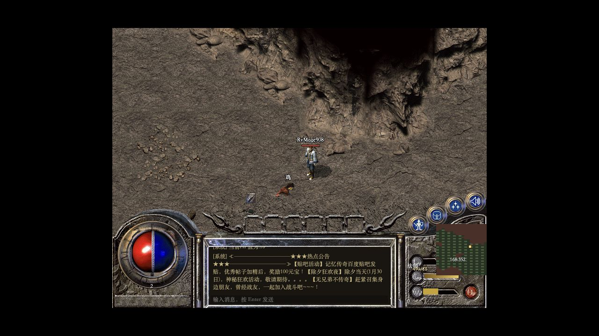
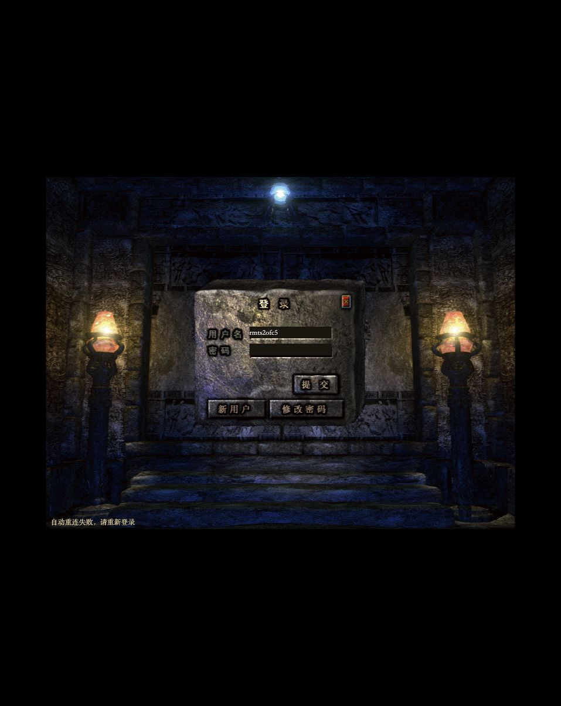
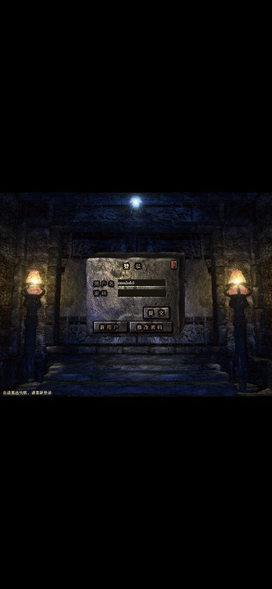

# 整体 Review 与实机试玩记录 · 2026-09-08

本轮完成代码审查、独立账号实机试玩、构建与离线回归，并记录 **10 项问题：P1 1 项、P2 9 项**。随后已按 R01–R10 完成代码修复和自动回归；受 E01 环境事件影响，需要真实服务的复验项目仍单独保留。

原始试玩证据汇总见 [evidence.json](2026-09-08/evidence.json)，完整本机日志位于 `.runtime/reports/review-2026-09-08/`，该运行目录不入 Git。下文保留修复前的复现记录，并在问题清单后记录关闭依据。

## 基线与证据边界

| 项目 | 本轮基线 |
|---|---|
| 时间 | 2026-09-08，实机约 10:49–11:02，随后完成离线复核与归档；Asia/Shanghai，引擎日志使用 UTC |
| 主仓库 | `3d52b23`，匹配跑步插值节奏 |
| OpenMir2 / 数据子模块 | `6ae4cb3` / `f38deae` |
| 已有未提交修改 | `content/classic-176/p0/cave-guide.txt`、`patches/openmir2/0015-seed-animal-harvest-meat.patch`、`scripts/prepare-runtime.py`、`vendor/openmir2`；全部保留 |
| 运行入口 | 本机 Vite `http://127.0.0.1:5173/play.html`，同源 `/ws` → `127.0.0.1:18800` |
| 实机 | macOS、Codex 内置 Chromium 浏览器、实际 WebSocket / OpenMir2 / MySQL；国服 UI 已导入 |
| 测试角色 | 本轮新建法师 `RvMage908`；独立账号凭据仅保存在忽略的 `.runtime/review-account-2026-09-08.json` |
| 当前运行世界 | `MapInfo.txt` 仅有 `0`、`D001`；`MapQuest.txt` 为 0 条 |
| 素材目录 | 570 张地图已导出；此项不证明当前进程加载了全部经典路线 |

证据分为三类：**实机复现**来自实际页面、截图与网络帧；**代码验证**来自当前处理器和隔离回放，不等同于完整联机复现；**覆盖缺口**明确本轮尚未验证的范围。历史验证结果继续保留在实施状态文档中。

## 实机试玩

| 顺序 | 操作与观察 | 结果 / 证据 |
|---|---|---|
| 1 | 登录页输入空账号注册，返回 `Invalid account`；输入符合长度限制的独立账号后完成注册、自动登录 | 注册正向流程通过；错误只有英文泛化说明，未单列高优先级问题 |
| 2 | 创建男性法师 `RvMage908`，开始游戏，进入银杏出生区 `0 / 649,631` | 创建、选角、入图通过；[出生画面](2026-09-08/01-first-spawn.png) |
| 3 | 背包点击木剑、布衣(男) | 两件物品离开背包，世界人物显示穿戴；通过 |
| 4 | 未开启交易，Shift 点击蜡烛，关闭并重开背包 | 蜡烛持续 disabled；跨图后仍锁定；**R02、R03** |
| 5 | 目标列表选择银杏导师 | 从 `649,631` 自动接近至 `648,629`，正常打开对话 |
| 6 | 选择“准备洞穴战斗测试” | 获得 30 级、三级雷电术、HP 128 / MP 541 和中量测试药品；本步只确认状态下发 |
| 7 | 进入兽人古墓，然后选择普通怪物测试 | `D001 / 152,362 → 168,350`；当前已修改的夹具把角色重置到 1 级并生成鸡，不能沿用历史“普通骷髅场景”结论 |
| 8 | 点击附近鸡尝试追击，前方格阻挡；手动向南、向东绕开 | `168,350 → 168,351 → 169,351`；隐藏状态节点提示尝试开门，画面没有可见失败说明；**R03** |
| 9 | 再次选择鸡，接近到 `168,352` 并持续近战 | 鸡在 `167,353` 降至 `0/5 HP`，角色升到 2 级，显示 `490/15` 经验；当前夹具给了 100 倍经验，此结果仅验收击杀、经验通知与一次升级 |
| 10 | 直接点击可见鸡尸体 | 抓到 `{"type":"move","x":167,"y":353,"direction":5,"run":false}`，没有 `butch`；**R05** |
| 11 | 从附近目标列表点击“挖肉”一次 | 存在替代入口；本轮未观察到肉入包，随后尸体消失，**挖肉入包不计通过** |
| 12 | 正常组合键 Shift+S，随后普通 S | `168,353 → 168,355 → 168,356`；收到两格跑步及一格行走；特殊松键顺序见代码验证 R04 |
| 13 | 运行环境意外断开 | 页面最终显示“自动重连失败，请重新登录”；重连恢复与后续玩法未完成，详见环境事件 E01 |

本轮没有发送聊天、私聊或其他对外消息，没有执行停服、数据库恢复或主动故障注入，也没有使用已有长期角色。独立测试账号保留，方便后续复测。

## 问题记录

优先级：P1 为应优先处理的核心一致性问题；P2 为影响正常操作、规则或验收可靠性的问题。代码路径均相对仓库根目录，行号对应本轮基线。

### R01 · P1 · 动作确认可能错误推进网关坐标

- **位置：** `services/web-gateway/GatewaySession.cs:229`、`:277`、`:494–506`。
- **触发：** 发起攻击后立即移动；攻击的迟到 `+GD/` 在移动等待期间到达。攻击没有参与移动 / 施法的统一待确认状态，移动入口也只检查 `pendingPosition`。
- **实际：** `+GD/` 无条件优先确认 `pendingPosition`。隔离回放以确认坐标 `(10,10)`、待确认 `(11,10)` 开始，收到通用成功后推进到 `(11,10)`；随后收到携带 `(10,10)` 的 `SM_MOVEFAIL(28)`，内部确认坐标仍为 `(11,10)`。
- **影响：** 迟到成功确认会让浏览器与网关推进到尚未获引擎接受的位置；后续移动拒绝未校正该位置，下一次移动或交互可能连续被拒绝并出现位置不同步。前端对应逻辑位于 `apps/web/src/play.ts:527–528`。
- **建议：** 统一关联产生通用确认的动作；处理拒绝时同步服务端权威位置。补攻击→移动、施法→移动及拒绝后继续移动的时序回归。
- **证据等级：** 代码审查与隔离协议回放；没有在本次浏览器中重现该竞态。诊断源码归档于本机 `existing-repro-evidence/gateway/`，首次回放原始 stdout 未落盘，后续修复需补持久化回归日志。

### R02 · P2 · 背包拒绝操作后物品持续禁用

- **位置：** `apps/web/src/inventory.ts:48,66`，`apps/web/src/play.ts:171,547`，`services/web-gateway/GatewaySession.cs:149`。
- **复现：** 入图→打开背包→在没有交易会话时 Shift 点击蜡烛→关闭 / 重开背包。
- **实际：** 客户端先把物品加入 pending；网关拒绝 `tradeAdd`，通用错误分支只解除技能等待态。蜡烛保持 disabled，跨图也未恢复。
- **影响：** 单次误操作即可让物品暂时无法使用、装备或丢弃。
- **建议：** 未开启交易时禁用交易快捷动作；所有操作拒绝、断线与取消路径按物品实例解除等待。验收重开背包、重连和快速连续操作。
- **证据等级：** 实机复现、截图、AX 与实际 TS 处理器探针；探针摘要在 `evidence.json.frontendProbe`。

### R03 · P2 · 入图后错误和操作结果被隐藏

- **位置：** `apps/web/play.html:110,114`，`apps/web/src/style.css:19`，`apps/web/src/play.ts:547`。
- **复现：** 触发 R02，或点击阻挡后的目标；观察游戏 HUD / 聊天区。
- **实际：** `#connection` 位于入图后整体隐藏的 `#auth-overlay` 中，`#combat-status` 也被开发界面样式隐藏。失败分支只更新这些节点，玩家没有可见说明。
- **影响：** 交易、施法、购买失败及移动拒绝表现为无响应，玩家难以判断原因或恢复操作。
- **建议：** 将操作结果投影到游戏内可见消息区，保留足够展示时间，并为辅助技术提供状态通知。操作成功 / 拒绝均应覆盖。
- **证据等级：** 实机与 DOM / CSS 验证；阻挡后隐藏节点确实显示“尝试打开门 · 169, 350”。

### R04 · P2 · Shift 跑步的松键顺序会遗留移动状态

- **位置：** `apps/web/src/play.ts:628–629`。
- **复现：** 按 Shift+D；先松 Shift，再松 D。补充检查按住移动时切到其他窗口。
- **实际：** 按下记录 `held.key='D'`，松开得到 `event.key='d'`，严格比较无法清除 held；当前也没有窗口失焦清理。
- **影响：** 后续确认会继续驱动跑步，直到阻挡或其他输入清除状态。
- **建议：** 使用稳定的 `event.code` 关联按下 / 松开，并在 blur / 页面隐藏时清空连续输入。
- **证据等级：** 执行真实事件处理器的确定性探针。自动化工具无法分开派发该修饰键松开顺序，本轮实机仅确认普通 Shift 跑步，未把特殊顺序列为实机通过项。

### R05 · P2 · 地图尸体无法直接点击挖肉

- **位置：** `apps/web/src/online-actors.ts:98`，`apps/web/src/play.ts:589`。
- **复现：** 击杀鸡→点击尸体像素范围。
- **实际：** `hitTest` 提前排除 `dead` 对象，已有挖肉分支不可达；实机点击尸体仅发送移动命令。
- **影响：** 地图上的自然交互入口失效。附近目标列表有“挖肉”替代入口，但本轮未验证收获入包。
- **建议：** 允许可收获尸体参与命中测试；区分活体攻击、尸体收获与地面移动，补击杀→点击尸体→收获入包的实机回归。
- **证据等级：** 实机截图、WebSocket 网络帧与源码执行。网络帧摘要已纳入 `evidence.json`。

### R06 · P2 · 第二枚戒指 / 手镯无法装备到另一侧

- **位置：** `apps/web/src/inventory.ts:130`，`services/web-gateway/GatewaySession.cs:1318`。
- **复现：** 背包内有两枚可穿戴戒指，连续点击装备；手镯同理。
- **实际：** 戒指始终发 `slot:7`，手镯始终发 `slot:5`，没有槽位 8 / 6 的选择入口。执行两个真实按钮处理器均得到 `slot:7`。
- **影响：** 第二件装备替换第一件，无法配齐双首饰属性。
- **建议：** 根据服务端装备快照选择空槽；两侧已满时明确替换规则或允许选择。
- **证据等级：** TS 按钮处理器与网关映射验证；本轮未准备两枚首饰做真实角色复测。

### R07 · P2 · 国服 UI 无法通过控件切换聊天频道

- **位置：** `apps/web/src/style.css:67`，`apps/web/src/play.ts:227`，`apps/web/play.html:119`。
- **复现：** 使用已导入国服 UI 入图，检查聊天栏和“聊天”页签。
- **实际：** 频道与私聊对象的 label 被 CSS 隐藏；聊天页签只关闭当前经典窗口。实机 AX 只有“内容”输入框。
- **影响：** 已实现的组队 / 行会 / 喊话 / 私聊选择控件无法使用，协议能力与可操作界面不一致。
- **建议：** 在经典聊天区保留频道与对象选择入口，检查键盘焦点与当前频道可见性；可另明确旧协议文本前缀的支持范围。
- **证据等级：** 实机初始 AX + CSS / 页签逻辑检查；没有发送消息，也未验证文本前缀替代方式。

### R08 · P2 · 低耐久装备扣除时发生无符号下溢

- **位置：** `vendor/openmir2/src/M2Server/Player/PlayObject.Attack.cs:1444–1447`；衣服 / 首饰同类写法位于 `PlayObject.cs:2949,2984`。
- **触发：** 当前武器耐久小于单次扣除值，例如 `Dura=1`、伤害为 2。
- **实际：** 在 `ushort` 上执行减法，结果绕回 `65535`，后续 `<=0` 判断无法触发损坏。隔离调用运行 DLL 的 `DoDamageWeapon` 得到 `1/4000 → 65535/4000`，物品 Index 仍为 1。
- **影响：** 应损坏的物品保留并出现超过最大值的耐久，破坏持久与修理规则。
- **建议：** 使用有符号中间值扣除并下限截断为 0，统一检查武器、衣服、饰品的扣除路径。
- **证据等级：** 当前源码与隔离 DLL 调用；本机 `existing-repro-evidence/durability/` 保留诊断源码，首次 stdout 未落盘；没有消耗真实玩家装备复测。

### R09 · P2 · 源数据包的旧运营公告进入试玩界面

- **位置：** `scripts/prepare-runtime.py:477` 导入 `Notice` 目录；运行 `Mir200/Notice`、`Envir` 的公告 / 登录脚本。
- **复现：** 新角色进入世界，继续游玩等待公告。
- **实际：** 聊天区显示旧私服名称、外部官网、客服 / 担保 QQ，随后还出现贴吧奖励和往年节庆活动。初始截图可直接看到这些内容。
- **影响：** 玩家容易把第三方旧运营联系方式和奖励内容理解为本项目提供的服务，公告还会挤占有限聊天区域。
- **建议：** 对导入公告与登录脚本做版本筛选，替换为本机测试说明；验收首次登录与定时公告两条入口。
- **证据等级：** 实机截图、聊天 AX 与导入路径核对。未访问公告中的网站或联系任何账号。

### R10 · P2 · 任务审计通过不能证明运行任务完整

- **位置：** `tools/quest_catalog_audit.py:100–120`。
- **复现：** 在当前 P0 运行目录执行任务目录审计。
- **实际：** `sourceEntries=1`、`runtimeEntries=0`、`runtimeMaps=["0","d001"]`，结果仍为 `ok=true`。检查仅遍历已经存在的 runtime 条目，没有表达所选运行模式应具备的完整任务集合。
- **影响：** 把“当前已有条目无错误”当成经典任务交付证据时会出现假阳性。P0 可以有意省略 Q001，但报告需要明确模式与未覆盖项。
- **建议：** 显式区分 P0 / classic-route 验收，校验所选模式的必需任务集合，报告 skipped / missing；补运行文件为空与部分缺失用例。
- **证据等级：** 本轮实际审计 JSON 与源码核对；原始 `quest-catalog.json` 位于本机 review 目录。

## 修复状态 · 2026-09-08

| 编号 | 状态 | 修复与自动验证 |
|---|---|---|
| R01 | 已修复 | 网关串行化攻击、移动和施法确认，移动拒绝采用服务端坐标恢复权威位置；GatewayRegression 覆盖攻击成功回包晚于移动请求的顺序。 |
| R02 | 已修复 | 交易拒绝和通用错误会解除背包、装备等待态；前端回归执行实际视图逻辑并确认物品恢复交互。 |
| R03 | 已修复 | 入图后增加可见且具 `aria-live` 的状态区，操作错误同时进入系统消息。 |
| R04 | 已修复 | 连续移动使用 `KeyboardEvent.code`，窗口失焦和页面隐藏时清空输入；回归覆盖先松 Shift 再松 D。 |
| R05 | 已修复 | 非自身尸体保留像素命中测试，点击可进入挖肉分支；回归覆盖尸体与自身排除边界。 |
| R06 | 已修复 | 第二枚戒指和手镯优先选择空的配对槽位；回归覆盖槽位 8 和 6。 |
| R07 | 已修复 | 聊天页签在经典窗口内显示频道、私聊对象、内容和发送控件，关闭后归位 HUD。 |
| R08 | 已修复 | 武器、衣服和随机受损装备共用饱和扣减，低于单次损耗时归零；CoreRegression 覆盖 4−5 与 5−4。 |
| R09 | 已修复 | 运行时准备会覆盖旧公告和登录提示为本地测试说明；当前 P0 运行目录已重建并核对旧网址与 QQ 不再出现。 |
| R10 | 已修复 | 审计显式区分 `p0` 和 `classic-route`，报告 expected、skipped、missing；当前 P0 跳过 Q001，经典路线缺失同一条目时返回失败。 |

自动回归已关闭代码层缺陷。R01、R05–R09 仍需在 E01 恢复后按原复现步骤完成真实服务复验，其中 R09 需同时观察首次登录和定时公告。

## 环境事件与未覆盖范围

**E01：运行环境中断，原因未定。** 约 11:02 本机 Docker socket 与 `18800` 转发不可用，浏览器有限重连结束。Colima VM 仍运行，从 `/tmp` 进入 VM 可读取 Docker 27.4.0；从项目目录进入则报项目路径不存在。11:03:10 UTC+8 对应的引擎容器退出记录为 `03:03:10Z`、exit 1、OOMKilled=false，容器日志有 `Bus error` 及多个子进程 `Aborted`。`colima start` 返回 already running。现有证据不足以确定挂载、转发异常与引擎退出的因果顺序；本轮没有重启整个 VM 或恢复数据库。

以下项目需要在环境恢复后继续验收，不能由本轮构建 / 目录审计推定通过：

- 雷电术真实目标施法、药品使用、肉入包、掉落拾取与任务交付。
- 商店买卖、修理、仓库存取、双首饰实际穿戴。
- 主动断线后完整状态恢复、死亡回城、停服保存与异常退出存档边界。
- 双客户端交易、组队、PK、行会 / 沙巴克战役、完整经典路线与长时稳定性。
- Safari / Firefox、移动端完整操作、音频听感与原端逐像素校准。

## 自动化验证与目录覆盖

| 验证 | 本轮结果 | 限制 |
|---|---|---|
| `npm run build` + `npm run test:web` | TypeScript + Vite 通过，699 模块；5 项交互回归通过 | 覆盖代码路径，真实服务复验范围见上文 |
| `python3 -m unittest discover -s tests -p 'test_*.py'` | **81 / 81** 通过 | 旧文档的 67、79 项属于历史记录 |
| `scripts/install-check.py` | 通过 | 执行时环境正常；不代表后续无中断 |
| 内容审计 + `--verify-hashes` | 570 / 570 地图，68 / 68 源文件哈希通过 | 生成目录与运行加载状态分别验收 |
| 世界 / 技能目录、技能视觉、技能战斗配置、怪物视觉、任务目录审计 | 工具均返回通过 | 任务完整性见 R10；技能战斗配置审计没有执行实时施法 |
| CoreRegression / GatewayRegression / CastleRegression | 本轮重跑 CoreRegression、GatewayRegression 均通过；历史 CastleRegression 结果保留 | Gateway 新增 R01 混合动作竞态，Core 新增 R08 零值边界 |
| 普通 / 100 对象帧预算页 | 各采样 8 秒；各保留 720 帧，p95 **9.1ms**，p99 9.3ms | 同一内置浏览器、静态参考场景的帧间隔；无联机战斗、无冷启动 / 长时性能结论 |
| 界面机械检测 | 5 条 warning，人工核实后未新增问题 | 3 处图片由运行时赋值；2 处尺寸动画仅是性能提示，不直接判定故障 |

全世界目录含 **207 种怪物 / 2,806 条刷怪定义**，其中 47 种已有视觉映射，**160 种缺视觉、15 种缺掉落定义**，另有 3 个已声明 SQL 缺口。P0 22 种怪物的视觉路由为 22 / 22，其中 4 项仍为候选。`content/classic-176/version-profile.json` 的 unresolved 文本仍包含“国服 UI 待导入”的历史描述，与本机已导入状态有偏差，后续需按“可重建产物 / 原端校准”分别维护。

首次怪物视觉审计与 Vite 重建 `dist` 同时执行，曾短暂读到缺文件；构建完成后复跑为 22 / 22。这次执行时序误差已留日志，不计产品缺陷。

## 界面技术抽样

界面保留经典素材与 800×600 设计坐标，外观方向一致。交互完成性仍有 R02 / R03 / R05 / R07 缺口，因此本轮界面验收未通过。以下为有限抽样的诊断分数，不构成 WCAG 合规认证。

| 维度 | 分数 / 4 | 依据 |
|---|---|---|
| 可访问性 | 2 | 登录输入具名称、主体按钮可定位；部分按钮名称为英文内部标识，关键错误缺少可见状态通知 |
| 性能 | 3 | 两组静态帧预算通过；联机长时、冷加载与混合战斗未覆盖 |
| 响应式 | 1 | 390×844 无横向溢出，但画面缩到 390×292.5，输入框与按钮随之缩小，触屏操作不宜视为已验收 |
| 主题维护 | 2 | 国服资源 / 回退路径明确；色值与布局覆盖分散于长 CSS，缺少统一复用边界 |
| 实现完整性 | 2 | 经典外观与服务端投影一致；错误恢复、尸体与频道入口失效 |
| 合计 | **10 / 20** | 需要补齐交互与验证覆盖 |

## 建议处理顺序与复验条件

1. 处理 R01，建立统一动作确认回归；修复后连续执行攻击→移动 / 施法→移动 / 服务端拒绝→再移动，确认两端坐标一致。
2. 处理 R02–R04，让拒绝操作能恢复、原因可见、松键能可靠停止；界面工作可使用 `$impeccable harden` 与 `$impeccable clarify`。
3. 处理 R05–R08，复测尸体收获、双首饰、频道入口与耐久损坏；交互修整可使用 `$impeccable harden`。
4. 处理 R09 / R10，筛选运营文本并明确 P0 / 完整路线验收模式；文案检查可使用 `$impeccable clarify`。
5. 恢复环境后完成本报告未覆盖的闭环，再用 `$impeccable audit` 复查；界面最后执行 `$impeccable polish`，保持经典 UI 约束。

上述工作可按优先级逐项处理，也可合并成一轮修复；每项完成后保留同样的操作前后截图、网络事件与存档结果，才能关闭对应问题。
